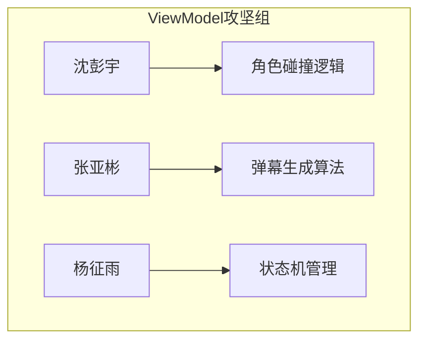
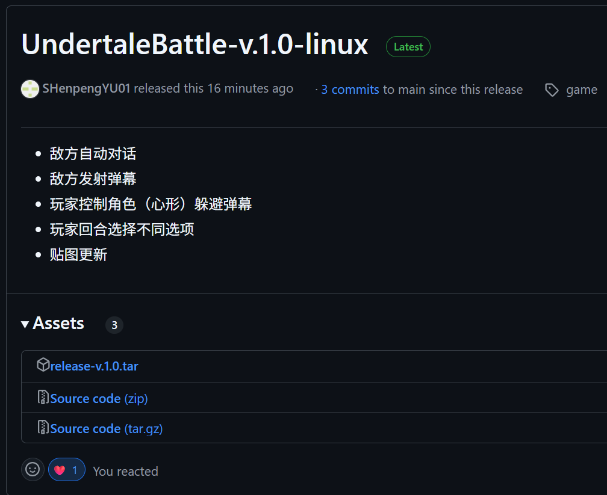
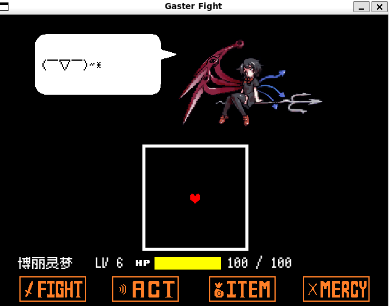
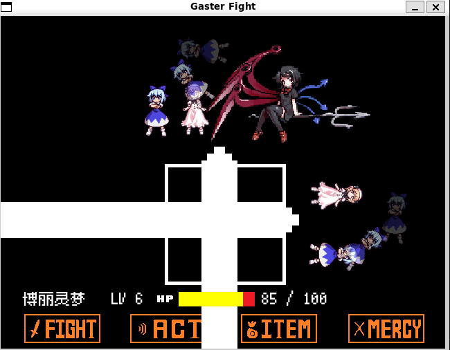
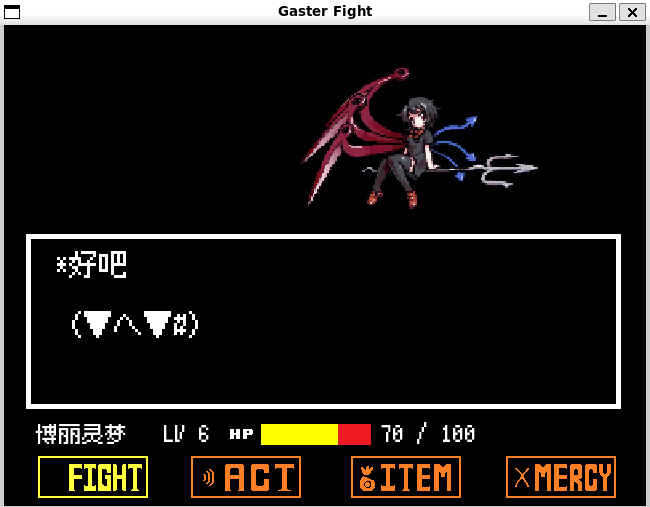
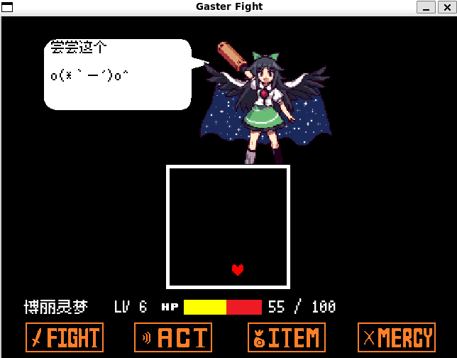

# C++ 弹幕躲避游戏项目总结报告

**组别**：躲避弹幕组

**成员**：  

- 沈彭宇（Common模块/App架构）  
- 张亚彬（View层核心开发）  
- 杨征雨（ViewModel/Model层架构）  

## 一、选题

### （一）项目需求

复刻《Undertale》战斗场景的弹幕躲避机制，采用MVVM架构实现模块化解耦。

### （二）开发规划

| 日期   | 目标                          | 协作重点                  |
|--------|-----------------------------|--------------------------|
| 6.30   | MVVM架构设计                | 全组讨论接口规范          |
| 7.1    | Common基础库交付            | 沈彭宇开发，组内评审API   |
| 7.2    | View/ViewModel框架搭建      | 张杨并行开发，每日代码审查|
| 7.3    | 模块联调 + 主程序逻辑       | 全员攻坚ViewModel角色逻辑 |
| 7.4    | 核心功能集成与测试          | 交叉测试+性能优化         |

### （三）技术栈与协作工具

| 类别         | 工具               | 协作应用场景                          |
|--------------|--------------------|---------------------------------------|
| **开发环境** | VSCode + WSL2      | 统一开发环境配置                      |
| **构建系统** | CMake + Ninja      | 自动化构建，支持并行编译              |
| **依赖管理** | vcpkg              | 集中管理SFML等三方库                  |
| **UI框架**   | SFML 2.5.1         | 跨平台图形渲染                        |
| **协作平台** | GitHub     | Issue跟踪+看板管理任务                |
| **沟通工具** | 微信群 + 线下集会  | 定期进度同步                   |

### （四）动态分工

#### 初期分工（7.1-7.2）

- 沈彭宇：common和app开发
- 张亚彬：view层实现
- 杨征雨：viewmodel/model层实现

#### 集中viewmodel层（7.3-7.4）



**调整原因**：ViewModel层复杂度超出预期，全员投入关键模块开发

## 二、中期总结

### （一）关键技术问题与协作解决方案

#### 1. MVVM层间耦合问题

- **问题现象**：ViewModel直接调用SFML渲染接口，View层与ViewModel层耦合度较高
- **解决方案**：
  1. 沈彭宇重构`Common::EventDispatcher`事件总线
  2. 引入**观察者模式**：`ViewModel.fire(RedrawEvent, params)`
  3. View层注册重绘处理器：`View.registerHandler(RedrawEvent, callback)`

#### 2. 主程序状态机臃肿

- **原始方案**：在与袁老师讨论后，发现app内的主程序百行switch-case状态机逻辑实现繁琐
- **优化过程**：使用函数数组实现，每个函数对应不同回合的逻辑，实现了模块化分解与函数级任务分配。

  ```cpp
  // 重构后状态机
  std::vector<TurnHandler> Turns = {
      &BattleTurn::init,      // 张亚彬实现
      &BattleTurn::playerTurn,// 沈彭宇实现
      &BattleTurn::enemyAttack// 杨征雨实现
  };
  Turns[currentTurn](); // 统一调度
  ```

### （二）团队协作情况

#### 1.协作机制

| 实践方式       | 执行频率   | 成效                          |
|----------------|------------|-------------------------------|
| GitHub Code Review | 每模块交付 | 发现接口不一致问题        |
| 结对编程       | 攻坚阶段   | ViewModel结构优化 |

#### 2.效能提升数据

- **并行开发**：View层与ViewModel层同步开发节省大量时间
- **知识共享**：团队搜集文档共享
- **问题响应**：以群内提问方式问题共同讨论，使平均问题解决时间大幅缩减

#### 3.改进点

1. **协作可视化**：可以使用Mermaid图表展示分工演进
2. **数据量化**：添加具体效率提升指标
3. **流程规范**：明确代码审查/例会等协作机制
4. **责任追溯**：关键技术点标注负责人
5. **版本意识**：记录架构迭代过程（如Common模块迭代）

### （三）部分成果展示

#### 1.实现结果说明

实现了如下内容：

- 敌方自动对话
- 敌方发射弹幕
- 玩家控制角色（心形）躲避弹幕
- 玩家回合选择不同选项

#### 2.结果展示

成果已发布到GitHub仓库 [UndertaleBattle](https://github.com/SHenpengYU01/UndertaleBattle)，Release页发布Linux版本可执行文件。



具体成果如下：

- 人物对话：


- 躲避弹幕：


- 玩家回合：


- 敌方回合：


### （四）、心得体会

### 1.团队整体收获

通过**模块化责任划分→动态任务调整→集中攻坚**的三段式协作，验证了MVVM架构在游戏开发中的可行性与高效性，建立了一套高效的C++协作开发流程。

### 2.成员个人感悟

- 沈彭宇：这次开发让我对MVVM模式有了更深入的认识，通过动手实现我了解了View层和ViewModel层是通过什么机制进行解耦合的。这种解耦合给我们并行开发带来了很大的便利，推进了项目的进度。GitHub的代码管理促进了我们成员间成果的共享和进度同步，多分支协同开发让我理解多人开发的基本模式。我希望之后的几天团队可以进一步加强交流，让技术沟通和代码协作变得更加顺畅。  

### （五）、未来开发计划

- 目前仅有简单横平竖直的激光弹幕，需要在ViewModel层添加更复杂的弹幕逻辑
- 玩家回合选择按钮，按钮启动后的逻辑和效果过于简单，需要丰富，具体有：
  - 为敌方添加血量，Fight按钮进行攻击
  - Act 按钮添加行为选项，推进对话与剧情
  - Item 按钮添加物品选项，使玩家获得不同的增益
  - Mercy 按钮添加更多文本故事

