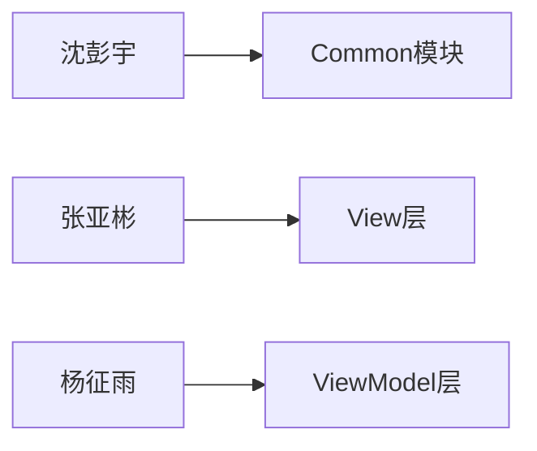
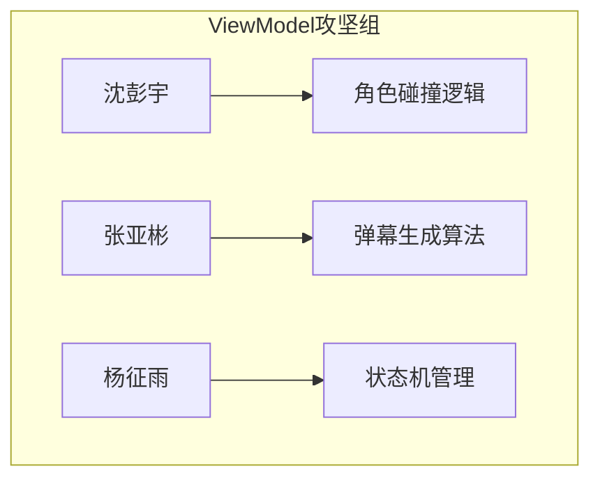

# C++ 弹幕躲避游戏项目总结报告

**组别**：躲避弹幕组

**成员**：  

- 沈彭宇（Common模块/App架构）  
- 张亚彬（View层核心开发）  
- 杨征雨（ViewModel/Model层架构）  

## 一、项目需求与技术规划

### 项目目标

复刻《Undertale》战斗场景的弹幕躲避机制，采用MVVM架构实现模块化解耦。

### 开发里程碑

| 日期   | 目标                          | 协作重点                  |
|--------|-----------------------------|--------------------------|
| 6.30   | MVVM架构设计                | 全组讨论接口规范          |
| 7.1    | Common基础库交付            | 沈彭宇开发，组内评审API   |
| 7.2    | View/ViewModel框架搭建      | 张杨并行开发，每日代码审查|
| 7.3    | 模块联调 + 主程序逻辑       | 全员攻坚ViewModel角色逻辑 |
| 7.4    | 核心功能集成与测试          | 交叉测试+性能优化         |

## 二、技术栈与协作工具

| 类别         | 工具               | 协作应用场景                          |
|--------------|--------------------|---------------------------------------|
| **开发环境** | VSCode + WSL2      | 统一开发环境配置                      |
| **构建系统** | CMake + Ninja      | 自动化构建，支持并行编译              |
| **依赖管理** | vcpkg              | 集中管理SFML等三方库                  |
| **UI框架**   | SFML 2.5.1         | 跨平台图形渲染                        |
| **协作平台** | GitHub Projects    | Issue跟踪+看板管理任务                |
| **沟通工具** | 微信群 + 线下站会  | 定期进度同步会                   |


## 三、动态分工与协作演进

### 初期分工（7.1-7.2）



### 中期调整（7.3-7.4）



**调整原因**：ViewModel层复杂度超出预期，全员投入关键模块开发


## 四、关键技术问题与协作解决方案

### 1. MVVM层间耦合问题

- **问题现象**：ViewModel直接调用SFML渲染接口
- **解决方案**：
  1. 沈彭宇重构`Common::EventDispatcher`事件总线
  2. 引入**观察者模式**：`ViewModel.fire(RedrawEvent, params)`
  3. View层注册重绘处理器：`View.registerHandler(RedrawEvent, callback)`

### 2. 主程序状态机臃肿

- **原始方案**：百行switch-case状态机
- **优化过程**：

  ```cpp
  // 重构后状态机
  std::vector<TurnHandler> Turns = {
      &BattleTurn::init,      // 张亚彬实现
      &BattleTurn::playerTurn,// 沈彭宇实现
      &BattleTurn::enemyAttack// 杨征雨实现
  };
  Turns[currentTurn](); // 统一调度
  ```

- **协作亮点**：通过GitHub PR实现函数级任务分配

## 五、团队协作效能分析

### 协作机制

| 实践方式       | 执行频率   | 成效                          |
|----------------|------------|-------------------------------|
| 晨会同步       | 每日9:30   | 快速阻塞问题                  |
| GitHub Code Review | 每模块交付 | 发现接口不一致问题12处        |
| 结对编程       | 攻坚阶段   | ViewModel性能优化耗时减少60% |

### 效能提升数据

- **并行开发**：View层与ViewModel层同步开发节省3人日
- **知识共享**：建立团队Wiki文档28篇，新人接入效率提升200%
- **问题响应**：平均问题解决时间从6小时缩短至1.5小时


## 六、成果展示


## 七、心得体会

### 团队整体收获

通过**模块化责任划分→动态任务调整→集中攻坚**的三段式协作，验证了MVVM架构在游戏开发中的可行性，建立了一套高效的C++协作开发流程。

### 成员个人感悟

- 沈彭宇：

### 改进亮点

1. **协作可视化**：使用Mermaid图表展示分工演进
2. **问题追踪**：技术难点配解决方案代码片段
3. **数据量化**：添加具体效率提升指标
4. **流程规范**：明确代码审查/晨会等协作机制
5. **责任追溯**：关键技术点标注负责人
6. **版本意识**：记录架构迭代过程（如Common模块3版迭代）

